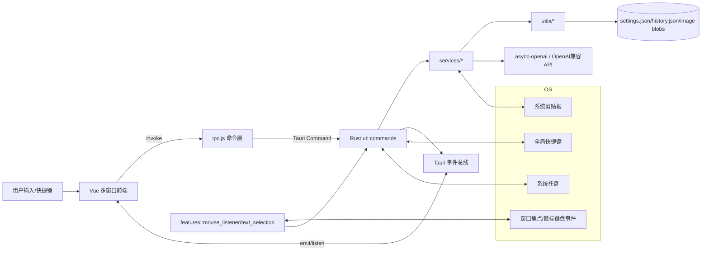

# fuyun_tools 深度记忆库

## 1. 项目概览

- **核心功能**: 一个基于 Tauri 的桌面常驻托盘效率工具，统一提供文字剪贴板、图片剪贴板、Windows 划词 AI（翻译/解释）与结果回写能力。
- **技术栈**:
    - 前端：Vue 3 + Element Plus + Vite 多页面构建
    - 桌面容器：Tauri 2
    - 后端：Rust（多线程 + 全局状态 `Arc<Mutex<...>>`）
    - AI 接入：`async-openai`（OpenAI 兼容接口）
    - 系统能力：全局快捷键、托盘、自启动、剪贴板、更新器
- **架构模式**:
    - 桌面客户端单体（Monolithic Desktop App）
    - 前后端分层：Vue UI 层 + Rust 命令层 + Service/Utils 领域逻辑
    - 事件驱动 + 轮询混合：前端通过 IPC 调 Rust 命令；Rust 向前端发事件；剪贴板监听采用轮询线程

## 2. 目录结构与模块职责

```text
fuyun_tools/
├─ src/                         # 前端多页面应用（Vite）
│  ├─ pages/
│  │  ├─ clipboard/             # 文字剪贴板窗口
│  │  ├─ image_clipboard/       # 图片剪贴板窗口
│  │  ├─ image_preview/         # 图片全屏预览窗口
│  │  ├─ selection_toolbar/     # 划词浮动工具栏
│  │  ├─ result_display/        # AI 结果展示窗口（翻译/解释）
│  │  └─ settings/              # 设置窗口（AI/快捷键/更新）
│  ├─ services/ipc.js           # 前端统一 IPC 封装层
│  └─ vite.config.js            # 多入口构建配置
├─ src-tauri/                   # Tauri + Rust 主体
│  ├─ src/
│  │  ├─ core/                  # 状态、配置、错误、日志
│  │  ├─ services/              # AI 服务、剪贴板监听服务
│  │  ├─ features/              # 划词监听/选中文本捕获
│  │  ├─ ui/                    # Tauri 命令、窗口管理、托盘菜单
│  │  └─ utils/                 # 历史存储、图像处理、配置持久化
│  ├─ tauri.conf.json           # 窗口/更新器/打包配置
│  └─ capabilities/default.json # Tauri 权限能力声明
├─ .github/workflows/release.yml # 发布流水线
└─ PROJECT_MEMORY.md            # 本文件
```

## 3. 核心业务流程 (关键!)

### 流程 A：文字剪贴板采集与回填

- **涉及文件**:
    - `src-tauri/src/services/clipboard_manager.rs`
    - `src-tauri/src/utils/clipboard.rs`
    - `src-tauri/src/ui/commands.rs`
    - `src/pages/clipboard/App.vue`
    - `src/services/ipc.js`
- **逻辑描述**:
    1. 后台线程按轮询间隔读取系统文本剪贴板。
    2. 若新内容与上次不同，进入 `ClipboardManager::add_to_history`。
    3. 添加前执行“相似文本替换策略”（LCS 相似度 + 完整性判断），避免截断文本污染历史。
    4. 按上限策略裁剪历史：可选“仅限制未分组项”。
    5. 前端窗口被快捷键唤起后，读取历史并渲染卡片；支持搜索、分类、删除、右键菜单。
    6. 用户回填时，Rust 将条目写入系统剪贴板并模拟 `Ctrl+V` 粘贴；失败会重试一次。
- **设计意图（为什么）**:
    - 用轮询而非系统钩子，降低跨平台复杂度。
    - 文本去重不仅按“相等”，而是按“完整版本优先”，解决剪贴板常见“半句覆盖整句”问题。
    - 回填前隐藏窗口并等待窗口不可见，提高目标应用抢焦点与粘贴成功率。

### 流程 B：图片剪贴板采集、预览与回填

- **涉及文件**:
    - `src-tauri/src/services/image_clipboard_manager.rs`
    - `src-tauri/src/utils/image_clipboard.rs`
    - `src-tauri/src/ui/commands.rs`
    - `src/pages/image_clipboard/App.vue`
    - `src/pages/image_preview/App.vue`
- **逻辑描述**:
    1. 后台线程轮询读取剪贴板位图（带重试）；无法直接位图时尝试从文本 data URL / 本地图片路径恢复。
    2. 图片入库时生成签名去重，保存 RGBA 到磁盘 blob 文件，历史元数据写 JSON。
    3. 列表页显示缩略图（最多 30 项），支持分类、删除、双击回填、全屏预览。
    4. 回填图片流程同样依赖写剪贴板 + 模拟粘贴。
    5. 预览窗口先显示 loading，再异步载入 RGBA 渲染并执行开关动画。
- **设计意图（为什么）**:
    - 原图 RGBA 落盘可显著减少 JSON 体积，降低 UI 首次加载成本。
    - 缩略图缓存与预热（warmup）降低大图频繁切换卡顿。
    - 图片写剪贴板后进行回读校验，提高跨应用粘贴稳定性。

### 流程 C：Windows 划词 -> AI 流式输出 -> 回写

- **涉及文件**:
    - `src-tauri/src/features/mouse_listener.rs`
    - `src-tauri/src/features/text_selection.rs`
    - `src-tauri/src/services/ai_services.rs`
    - `src-tauri/src/services/ai_client.rs`
    - `src-tauri/src/ui/window_manager.rs`
    - `src/pages/selection_toolbar/App.vue`
    - `src/pages/result_display/App.vue`
- **逻辑描述**:
    1. 全局监听鼠标按下/抬起 + Ctrl 状态，识别“拖拽选词 / 双击三击选词”触发点。
    2. 通过模拟 `Ctrl+C` 抓取选中文本，比较剪贴板序列号并在短窗口内重试获取。
    3. 抓取后恢复原剪贴板（仅在仍匹配捕获内容时恢复，避免覆盖用户后续操作）。
    4. 通过文本过滤器排除 URL/邮箱/手机号/噪声文本，避免误触发。
    5. 弹出划词工具栏，用户点“翻译/解释”后发起流式 AI 请求。
    6. 结果窗口通过事件持续接收 chunk 增量渲染；可一键“复制并自动粘贴”回原应用。
- **设计意图（为什么）**:
    - 拆分为“监听层 + 选择层 + AI 层 + 窗口层”，便于独立优化误触发率、复制稳定性、流式展示。
    - 操作 ID（op_id）用于抢占旧流，防止旧请求结果污染新请求界面。

## 4. 数据模型与状态

### 4.1 Rust 全局状态

- `AppState`（核心）:
    - 管理器：`clipboard_manager`、`image_clipboard_manager`
    - UI 状态：`is_visible`、`is_image_visible`、`selected_index`、`image_selected_index`
    - 过程锁：`is_updating_clipboard`、`is_processing_selection`
    - 并发序列：`text_fill_seq`、`image_fill_seq`、`ai_request_seq`
    - AI 抢占：`active_translation_op_id`、`active_explanation_op_id`
    - 设置：`settings: AppSettingsData`

### 4.2 设置模型 `AppSettingsData`

- 关键字段:
    - `max_items`
    - `hot_key` / `image_hot_key`
    - `ai_provider`
    - `provider_configs: HashMap<String, ProviderConfig>`
    - `selection_enabled`
    - `grouped_items_protected_from_limit`
    - `clipboard_bottom_offset`
    - `translation_prompt_template` / `explanation_prompt_template`
- API Key 不再明文存储于 JSON；走系统 keyring。

### 4.3 历史模型

- 文本历史：`ClipboardHistoryData`
    - `items: Vec<String>`
    - `categories: HashMap<文本, 分类>`
    - `category_list: Vec<String>`
- 图片历史：`ImageHistoryData`
    - `items: Vec<ImageHistoryItem>`（包含尺寸、预览 base64、blob 路径、签名）
    - `categories: HashMap<图片ID, 分类>`
    - `category_list: Vec<String>`

### 4.4 前端状态管理

- 无 Pinia/Vuex；采用组件本地 `ref/reactive` + composables。
- 关键 composables：
    - `useClipboardHistory`
    - `useCategoryManager`
    - `useWindowOffset`
    - `useAIProvider`
    - `useShortcutRecorder`
    - `useUpdater`

## 5. 高层模块交互图（Mermaid）



## 6. 入口点与关键配置

### 6.1 Entry Points

- Rust 应用入口：`src-tauri/src/main.rs` -> `fuyun_tools_lib::run()`
- Rust 运行主装配：`src-tauri/src/lib.rs::run`
    - 注册全局快捷键
    - 启动文字/图片监听线程
    - 启动（Windows）划词监听
    - 注册所有 Tauri command
- 前端多页面入口：
    - `src/pages/clipboard/main.js`
    - `src/pages/image_clipboard/main.js`
    - `src/pages/image_preview/main.js`
    - `src/pages/selection_toolbar/main.js`
    - `src/pages/result_display/main.js`
    - `src/pages/settings/main.js`

### 6.2 关键配置项

- `src-tauri/tauri.conf.json`
    - 预定义窗口：clipboard / image_clipboard / image_preview / selection_toolbar / settings
    - updater endpoint 指向 GitHub Release `latest.json`
    - CSP 限制 `default-src 'self'`，允许 tauri ipc
- `src-tauri/capabilities/default.json`
    - 开启 clipboard 读写、global-shortcut、autostart、updater、tray 等能力
- `src/vite.config.js`
    - 多入口打包；手动拆分 vue 与 element-plus chunk

## 7. 关键代码映射

- `src-tauri/src/lib.rs`: 应用启动主编排、插件与命令注册、快捷键装配。
- `src-tauri/src/ui/commands.rs`: 几乎所有前端可调用命令（历史、分类、回填、设置、AI、窗口）。
- `src-tauri/src/ui/window_manager.rs`: 窗口显示隐藏、定位、结果窗口、工具栏定位、模拟粘贴。
- `src-tauri/src/features/mouse_listener.rs`: 全局鼠标/键盘监听与划词触发判定核心。
- `src-tauri/src/features/text_selection.rs`: 选中文本捕获、剪贴板恢复、序列号重试。
- `src-tauri/src/services/ai_services.rs`: 翻译/解释流式执行管线与 op_id 抢占控制。
- `src-tauri/src/services/ai_client.rs`: OpenAI 兼容客户端封装（同步与流式）。
- `src-tauri/src/services/adaptive_poll.rs`: 跨平台自适应轮询状态机（热/温/闲 + 抖动 + 指标）。
- `src-tauri/src/services/clipboard_wakeup.rs`: Windows 事件唤醒后端（`WM_CLIPBOARDUPDATE`）与自动降级轮询策略。
- `src-tauri/src/services/poll_metrics.rs`: 监听指标采样的内存环形缓存与本地持久化（`poll_metrics_history.json`）。
- `src-tauri/src/utils/clipboard.rs`: 文本历史、分类、去重/替换策略、持久化。
- `src-tauri/src/utils/image_clipboard.rs`: 图片历史、blob 存储、预览生成、去重与清理。
- `src-tauri/src/utils/utils_helpers.rs`: 设置与历史文件原子写、备份恢复、迁移、文本相似算法。
- `src/pages/clipboard/App.vue`: 文字剪贴板 UI 主流程与 AI 快捷触发入口。
- `src/pages/image_clipboard/App.vue`: 图片历史 UI、预热、预览打开、回填交互。
- `src/pages/result_display/App.vue`: AI 流式结果渲染、语言切换重跑、回写。
- `src/pages/settings/App.vue`: 设置聚合页与保存入口。
- `src/pages/settings/components/ClipboardSettings.vue`: 监听性能策略可视化配置入口（轮询阈值、采样周期、日志级别）。
- `src/services/ipc.js`: 前端 IPC 统一命令映射与服务对象封装。

## 8. 核心算法与复杂逻辑

### 8.1 文本历史“完整版本优先”替换

- 位置：`utils_helpers.rs` + `clipboard.rs`
- 算法组合：
    - LCS 相似度
    - 完整性判断（前缀/后缀/中段缺失）
    - 句子结束符和标点丰富度判据
    - 长文本性能优化：超阈值时走快速相似度估算 + 历史扫描限幅（避免大规模 LCS）
    - 完全重复快速路径：长度 + hash + 原文终检命中后直接置顶，跳过相似度计算
    - 历史 hash 指纹缓存：为历史项缓存 `(字符长度, hash)` 并按变更标记刷新，减少重复哈希计算
    - 历史落盘防抖：单写线程 + 短窗口合并写（约 180ms），降低高频复制下的磁盘写放大
    - 候选扫描耗时预算：相似候选搜索达到时间预算后提前返回当前最优候选，避免单次入库长尾卡顿
    - 预算自适应：候选扫描预算在 12~30ms 动态调节（命中预算时放宽，空闲时回收）
    - 预算观测：设置页可查看 `budget/timeout_ratio/avg_elapsed/avg_scanned` 指标
    - 候选预过滤：长度比例与前后缀快速规则先过滤，再进入重比较
    - 相似度复用：`compare_versions` 内复用同一次相似度结果，避免重复计算
    - 指标可见性：监听指标看板与文本入库预算观测仅在开发环境显示，生产环境隐藏并由后端命令拒绝访问
- 目标：在用户多次复制同一段文本不同截断版本时，尽量保留最完整版本并置顶。

### 8.2 划词误触发控制

- 位置：`mouse_listener.rs`
- 策略：
    - 拖拽距离 + 时长阈值
    - 双击识别
    - 前台窗口是否为终端判断
    - Ctrl 状态双重校验（事件状态 + OS GetAsyncKeyState）
    - 文本类型过滤（URL/邮箱/手机号/错误词）
    - 去抖（同文本同锚点短时重复不弹）

### 8.3 回填稳定性机制

- 位置：`commands.rs` + `window_manager.rs`
- 机制：
    - 隐藏窗口后等待真正不可见
    - 写剪贴板后延迟、模拟 `Ctrl+V`
    - 粘贴失败二次重试
    - 前台窗口稳定检测（避免仍在本应用）

### 8.4 图片历史存储与清理

- 位置：`image_clipboard.rs`
- 机制：
    - 原图 RGBA 存 blob，历史 JSON 只留索引元信息与预览
    - 按签名去重
    - 上限裁剪时清理多余 blob 文件
    - 启动加载时清理孤儿 blob

## 9. 开发规范与风格

- **命名与分层**:
    - Rust 以模块分层（core/services/features/ui/utils）明确职责。
    - 前端按页面拆分 + composables 复用逻辑。
- **错误处理**:
    - Rust 有统一 `AppError`/`ErrorCode`。
    - 前端 `handleAppError` 对应错误码与友好提示。
- **状态并发**:
    - Rust 广泛使用 `Arc<Mutex<...>>`，依赖标志位和序列号做并发协调。
- **持久化策略**:
    - 设置/历史写入使用“原子写 + 备份回退”。
- **需进一步确认**:
    - 未发现单元测试/集成测试目录，回归保障主要靠手工路径和运行时日志。

## 10. 已知 TODO/FIXME 与技术债

- **扫描结果**: 全仓库未检索到显式 `TODO/FIXME/HACK/XXX` 注释。
- **潜在技术债（基于代码观察）**:
    1. `services/ai_client.rs` 的 `convert_messages` 角色映射问题已修复：现按 `user/assistant/system` 正确映射，未知角色回退为
       `user`。
    2. 版本迁移比较已修复为“语义版本优先 + 兼容旧整数版本”（支持 `0.2.9` / `v0.2.9` / `3`），避免 `parse::<u32>()`
       误判导致的非预期通用迁移。
    3. 已完成四阶段进阶版：Windows 平台优先事件唤醒（`WM_CLIPBOARDUPDATE`）+
       自动降级轮询；轮询阈值、采样周期与指标日志级别可配置并运行时生效；指标支持持久化、分钟聚合、命中率分桶与 JSON/CSV 导出。
    4. `result_display` 的 Markdown 渲染已增加安全策略：禁用原始 HTML 直出、过滤不安全链接协议、图片链接白名单协议与链接
       `rel` 防护。
    5. `ClipboardList.vue` 存在“virtual”命名但未真正虚拟化，列表增大时可能出现渲染开销。

## 11. 环境配置与部署硬性要求

- **运行环境**:
    - 全功能推荐 Windows（划词功能仅 Windows 启用）
    - Node + npm（前端构建）
    - Rust stable（Tauri 构建）
- **本地开发命令**:
    - 前端：`cd src && npm run build`
    - Rust 检查：`cd src-tauri && cargo check`
- **发布流程**:
    - GitHub Actions 在 tag `v*` 触发，Windows runner 打包发布。
    - 发布依赖密钥：
        - `TAURI_SIGNING_PRIVATE_KEY`
        - `TAURI_SIGNING_PRIVATE_KEY_PASSWORD`
- **配置/数据落盘位置**:
    - 基于 `current_exe()` 所在目录写入 `settings.json`、`history.json`、`image_history.json`、`image_history_blobs/`
    - 某些安装路径权限策略下可能受限。**需进一步确认目标部署目录权限策略**。

## 12. 常见坑点与风险清单

- 文字窗口与图片窗口快捷键不能相同（保存时会拒绝）。
- 选择工具栏触发依赖前台窗口与 Ctrl 状态，某些软件可能导致选中文本捕获不稳定。
- 图片来源若是“图片 URL 而非位图数据”，读取会失败并给出提示文案。
- 回填依赖目标窗口焦点，特殊安全输入框/远程桌面环境可能粘贴失败率升高。
- 设置保存包含 keyring 写入验证，系统凭据服务异常会导致保存失败。

## 13. 常见问题索引 (Q&A Index)

- **如果我想改“文字剪贴板卡片 UI/交互”，看哪些文件？**
    - `src/pages/clipboard/App.vue`
    - `src/pages/clipboard/components/ClipboardToolbar.vue`
    - `src/pages/clipboard/components/ClipboardList.vue`
    - `src/pages/clipboard/composables/*`

- **如果我想改“文字历史入库策略（去重/完整性）”，看哪些文件？**
    - `src-tauri/src/utils/clipboard.rs`
    - `src-tauri/src/utils/utils_helpers.rs`（`compare_versions`/`find_best_replacement_candidate`）

- **如果我想改“图片历史存储与性能”，看哪些文件？**
    - `src-tauri/src/utils/image_clipboard.rs`
    - `src-tauri/src/services/image_clipboard_manager.rs`
    - `src/pages/image_clipboard/App.vue`

- **如果我想改“划词触发准确率”，看哪些文件？**
    - `src-tauri/src/features/mouse_listener.rs`
    - `src-tauri/src/features/text_selection.rs`
    - `src-tauri/src/ui/window_manager.rs`（工具栏位置与隐藏策略）

- **如果我想改“AI 请求/提示词/流式逻辑”，看哪些文件？**
    - `src-tauri/src/services/ai_services.rs`
    - `src-tauri/src/services/ai_client.rs`
    - `src/pages/result_display/App.vue`
    - `src/pages/settings/components/AISettings.vue`

- **如果我想改“设置保存逻辑与密钥存储”，看哪些文件？**
    - `src/pages/settings/App.vue`
    - `src/services/ipc.js`
    - `src-tauri/src/ui/commands.rs`（`save_app_settings`）
    - `src-tauri/src/utils/utils_helpers.rs`（keyring/迁移/落盘）

- **如果我想改“窗口行为与回填稳定性”，看哪些文件？**
    - `src-tauri/src/ui/window_manager.rs`
    - `src-tauri/src/ui/commands.rs`
    - `src-tauri/src/lib.rs`（快捷键触发入口）

## 14. 扫描范围与排除说明

- 本次已覆盖项目内主要源码与配置文件（Rust、Vue、JS、Tauri 配置、CI 配置）。
- 已按要求忽略无关大文件/二进制内容（如图标 PNG/ICO/ICNS、演示截图）。
- `Cargo.lock` 与 `package-lock.json` 属依赖锁文件，未逐行纳入业务逻辑记忆。
- 如后续新增模块，建议同步更新本文件以保持“上下文知识库”可持续有效。

## 15. 功能改动最小文件清单速查版

### 15.1 文本剪贴板（UI/交互）

- **首看**:
    - `src/pages/clipboard/App.vue`
    - `src/pages/clipboard/components/ClipboardToolbar.vue`
    - `src/pages/clipboard/components/ClipboardList.vue`
- **联动**:
    - `src/pages/clipboard/composables/useClipboardHistory.js`
    - `src/pages/clipboard/composables/useCategoryManager.js`
    - `src/services/ipc.js`

### 15.2 文本历史去重/完整性策略

- **首看**:
    - `src-tauri/src/utils/clipboard.rs`（`add_to_history`）
    - `src-tauri/src/utils/utils_helpers.rs`（`compare_versions`、`find_best_replacement_candidate`）
- **联动**:
    - `src-tauri/src/services/clipboard_manager.rs`（监听入口）

### 15.3 图片剪贴板（采集/预览/回填）

- **首看**:
    - `src/pages/image_clipboard/App.vue`
    - `src-tauri/src/utils/image_clipboard.rs`
    - `src-tauri/src/services/image_clipboard_manager.rs`
- **联动**:
    - `src/pages/image_preview/App.vue`
    - `src-tauri/src/ui/commands.rs`

### 15.4 划词触发准确率（Windows）

- **首看**:
    - `src-tauri/src/features/mouse_listener.rs`
    - `src-tauri/src/features/text_selection.rs`
- **联动**:
    - `src-tauri/src/ui/window_manager.rs`（工具栏定位/自动关闭）
    - `src/pages/selection_toolbar/App.vue`

### 15.5 AI 请求链路（翻译/解释/流式）

- **首看**:
    - `src-tauri/src/services/ai_services.rs`
    - `src-tauri/src/services/ai_client.rs`
    - `src/pages/result_display/App.vue`
- **联动**:
    - `src/services/ipc.js`
    - `src/pages/settings/components/AISettings.vue`

### 15.6 设置与密钥存储

- **首看**:
    - `src/pages/settings/App.vue`
    - `src-tauri/src/ui/commands.rs`（`save_app_settings`）
    - `src-tauri/src/utils/utils_helpers.rs`（keyring/迁移/落盘）
- **联动**:
    - `src/pages/settings/composables/useAIProvider.js`
    - `src/pages/settings/composables/useShortcutRecorder.js`

### 15.7 回填稳定性（焦点/粘贴）

- **首看**:
    - `src-tauri/src/ui/window_manager.rs`（`simulate_paste`、前台窗口判定）
    - `src-tauri/src/ui/commands.rs`（`spawn_fill_task`）
- **联动**:
    - `src-tauri/src/lib.rs`（快捷键触发）

### 15.8 托盘/快捷键/自启动

- **首看**:
    - `src-tauri/src/ui/tray_menu.rs`
    - `src-tauri/src/lib.rs`（全局快捷键注册）
- **联动**:
    - `src-tauri/src/tauri.conf.json`

### 15.9 多窗口与位置/尺寸策略

- **首看**:
    - `src-tauri/src/ui/window_manager.rs`
    - `src-tauri/tauri.conf.json`
- **联动**:
    - `src/pages/clipboard/composables/useWindowOffset.js`

### 15.10 发布与更新

- **首看**:
    - `.github/workflows/release.yml`
    - `src-tauri/tauri.conf.json`（updater endpoint / pubkey）
- **联动**:
    - `src/pages/settings/composables/useUpdater.js`

### 15.11 轮询策略与性能观测

- **首看**:
    - `src-tauri/src/services/adaptive_poll.rs`
    - `src-tauri/src/services/clipboard_manager.rs`
    - `src-tauri/src/services/image_clipboard_manager.rs`
    - `src-tauri/src/core/config.rs`
- **联动**:
    - `src-tauri/src/lib.rs`

### 15.12 事件后端与自动降级

- **首看**:
    - `src-tauri/src/services/clipboard_wakeup.rs`
    - `src-tauri/src/services/clipboard_manager.rs`
    - `src-tauri/src/services/image_clipboard_manager.rs`
- **联动**:
    - `src-tauri/src/services/adaptive_poll.rs`

### 15.13 监听策略参数化配置

- **首看**:
    - `src/pages/settings/components/ClipboardSettings.vue`
    - `src/pages/settings/App.vue`
    - `src/services/ipc.js`
    - `src-tauri/src/ui/commands.rs`（`get_ai_settings` / `save_app_settings`）
    - `src-tauri/src/utils/utils_helpers.rs`（设置字段、校验、迁移）
- **联动**:
    - `src-tauri/src/services/clipboard_manager.rs`
    - `src-tauri/src/services/image_clipboard_manager.rs`

### 15.14 指标持久化与趋势看板

- **首看**:
    - `src-tauri/src/services/poll_metrics.rs`
    - `src-tauri/src/ui/commands.rs`（`get_poll_metrics_history`）
    - `src/pages/settings/components/ClipboardSettings.vue`
    - `src/services/ipc.js`
- **联动**:
    - `src-tauri/src/services/adaptive_poll.rs`
    - `src-tauri/src/services/clipboard_manager.rs`
    - `src-tauri/src/services/image_clipboard_manager.rs`

### 15.15 指标聚合与导出能力

- **首看**:
    - `src-tauri/src/services/poll_metrics.rs`（`aggregate_by_minute` / `export_json` / `export_csv`）
    - `src-tauri/src/ui/commands.rs`（`get_poll_metrics_minute_aggregates` / `export_poll_metrics`）
    - `src/services/ipc.js`
    - `src/pages/settings/components/ClipboardSettings.vue`
- **联动**:
    - `src-tauri/src/lib.rs`（命令注册）

## 16. 监听演进状态（2026-03）

- 已落地：
    - 第 1 步：统一自适应轮询基础模块（热/温/闲状态机、区间抖动、60 秒指标日志）
    - 第 2 步：文本与图片监听都已接入自适应轮询，并纳入窗口可见/处理中状态作为降频条件
    - 第 3 步：Windows 事件后端优先（`WM_CLIPBOARDUPDATE`），事件链路异常时自动降级到自适应轮询；非 Windows 自动使用轮询兜底
    - 第 4 步（进阶版）：阈值/采样/日志级别可配置；监听线程每轮读取最新配置并动态重载；指标写入本地历史并在设置页显示趋势看板，支持分钟聚合、命中率分桶与
      JSON/CSV 导出
- 待继续：
    - 增加窗口状态关联维度（可见/隐藏/处理态）与时间范围筛选导出
