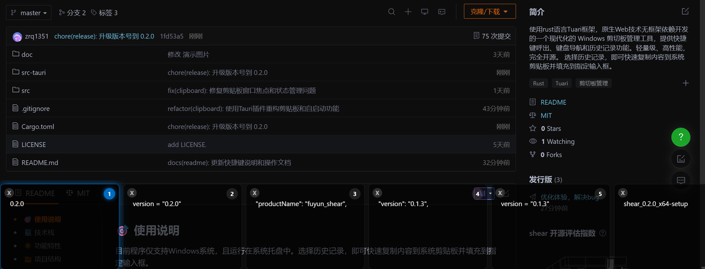
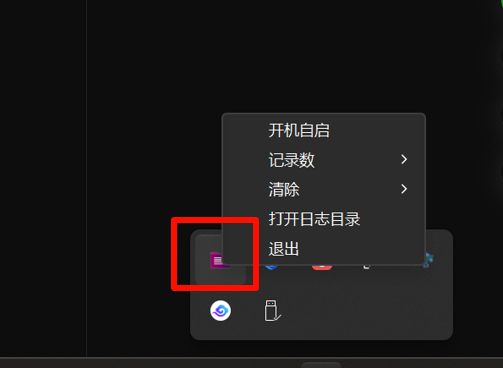

## 🎯 使用说明
   目前程序支持 Windows系统，且运行在系统托盘中。选择历史记录，即可快速复制内容到系统剪贴板并填充到指定输入框。

## 💻 技术栈

- **前端**: HTML/CSS/JavaScript
- **后端**: Rust + Tauri
- **UI**: 原生Web技术，无框架依赖

## 🌟 功能特性

- 快捷键唤出剪贴板历史（Windows/Linux: Ctrl+Shift+K, macOS: Cmd+Shift+K）
- 方向键导航选择历史记录
- 回车键复制选中内容
- 鼠标点击选择
- 双击快速复制
- 拖拽滚动
- 支持删除历史记录
- 系统托盘菜单配置

## 📁 项目结构

```
shear/
├── src/                    # 前端源代码
│   ├── index.html          # 主页面文件
│   ├── styles/             # 样式文件
│   │   └── main.css        # 主样式表
│   ├── scripts/            # 脚本文件
│   │   └── main.js         # 主脚本
│   └── assets/             # 静态资源
├── src-tauri/              # Tauri 后端代码
│   ├── src/
│   │   ├── main.rs         # 应用入口
│   │   ├── lib.rs          # 核心功能实现
│   │   ├── clipboard.rs    # 剪贴板管理
│   │   ├── config.rs       # 配置管理
│   │   ├── utils.rs        # 工具函数
│   │   └── autostart.rs    # 自启动功能
│   ├── tauri.conf.json     # Tauri 配置文件
│   └── Cargo.toml          # Rust 依赖管理
└── README.md               # 项目说明
```

## 📥 下载地址
- gitee可能不是最新版本，建议到github下载

| gitee                                          | github                                          |
|------------------------------------------------|-------------------------------------------------|
| [下载](https://gitee.com/zrq1351/fuyun_tools/releases) | [下载](https://github.com/zRq1351/fuyun_tools/releases) |


### 🖱️ 基本操作

1. **呼出剪切板**：按下默认快捷键 `Ctrl+Shift+K`（macOS 使用 `Cmd+Shift+K`）
2. **选择内容**：
   - 键盘：使用 `←` `→` 方向键浏览历史记录
   - 鼠标：拖动卡片浏览历史记录
3. **确认**：
   - 键盘：按 `Enter` 键将选中内容复制到剪贴板并填充到指定输入框
   - 鼠标：双击卡片复制到剪贴板并填充到指定输入框
4. **关闭界面**：
   - 按下 `Esc`键关闭界面
   - 窗口失去焦点或者确认填充的内容后关闭
5. [观看演示视频](https://www.bilibili.com/video/BV1bwBSBUE8k)

### ⚙️ 系统托盘菜单

右键点击系统托盘图标显示以下选项：

#### 记录数设置
- **20条记录** - 限制最多保存20条历史记录
- **50条记录** - 限制最多保存50条历史记录  
- **100条记录** - 限制最多保存100条历史记录
- **200条记录** - 限制最多保存200条历史记录

#### 清除功能
- **清除记录** - 清空所有剪切板历史记录
- **清除日志** - 清除应用程序日志文件

#### 其他功能
- **打开日志目录** - 在文件资源管理器中打开日志目录
- **退出** - 完全退出应用程序
